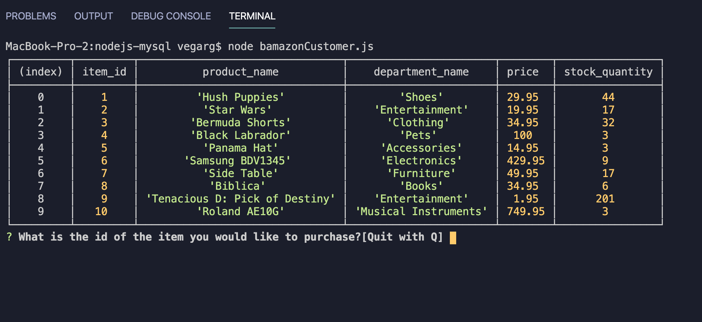
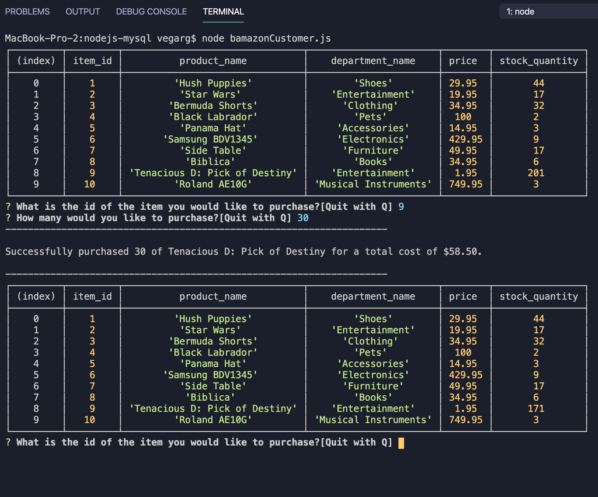
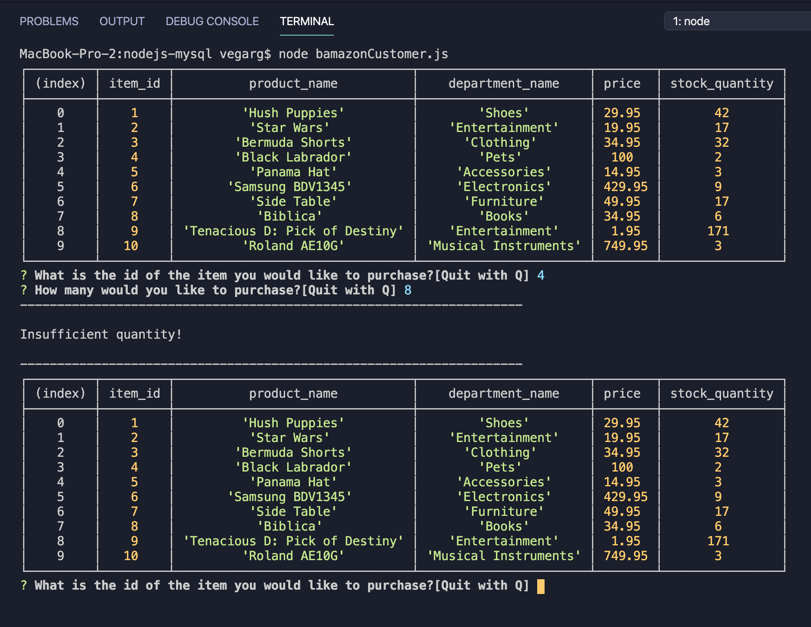
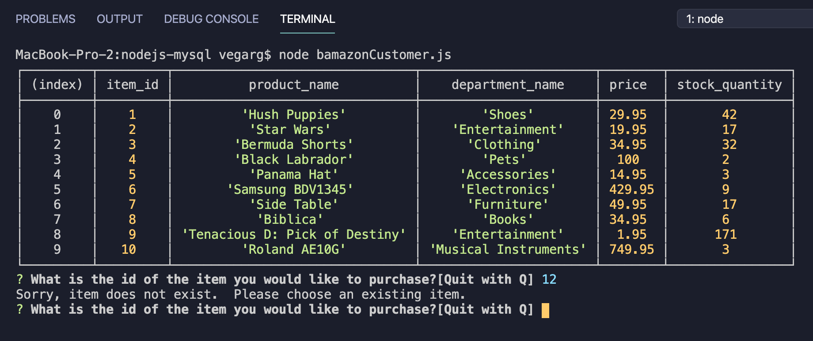
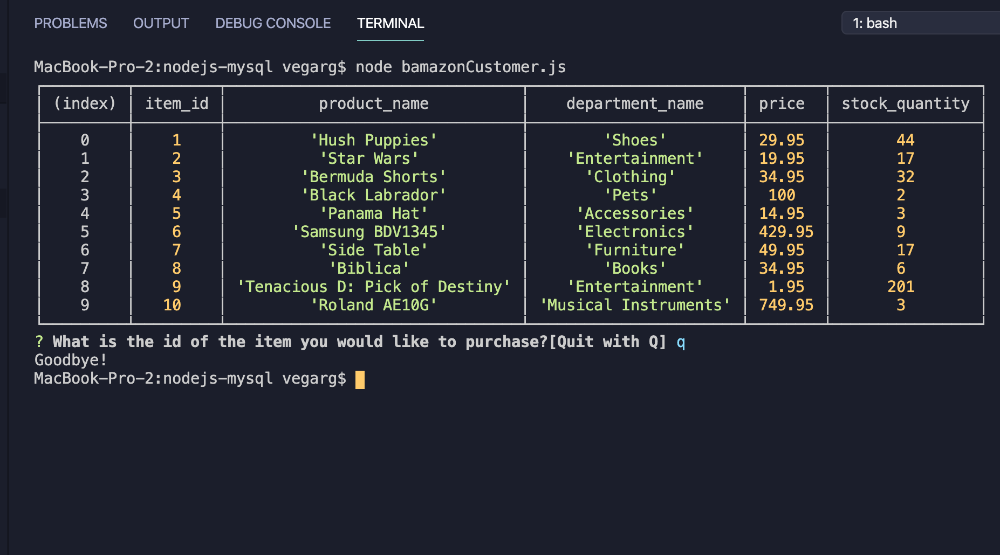

# nodejs-mysql app 
### (Note: this file is mark-down formatted to be read in a code-editor "preview" function or on github)
## Welcome to the readme file for my nodejs-mysql app!  This application is available at the following github repository:  

* https://github.com/rgvegajr/nodejs-mysql

## Background/Purpose:

This command-line application incorporates a MySQL database with nodejs to demonstrate read and update functionality of the database via a command-line interface using a "bamazon" storefront.  The node.js filename is bamazonCustomer.js which, when run, generates a command-line user interface with a table of items to purchase, user prompts for item to buy and quantity desired (or to enter Q to quit) and includes rudimentary input data verification.

## Technologies used:

node.js, with inquirer and mysql npm packages installed.  npm inquirer provides the user prompt funcitonality. npm mysql provides the database manupulation functionality.

## My role:  

I am the app developer.  I used MS Visual Studio Code as my integrated development environment and Github for repository and version control.  Bootcamp instructors provided guidelines, instructions and requirements for this app.

## App Organization:

The code is organized as follows:
1.  Required modules import
2.  Global variables declared
3.  Function declarations to enable a customer to view items available for purchase, enter a selected item id and purchase quantity which results in a purchase total and a decrement of item stock.
4.  Function call to generate comandline based user interface and prompts.

## Instructions (These instructions assume user is familiar with GITHUB and node js and has installed node.js on a PC/Mac.):

1.  Open a terminal/bash window on your PC/Mac.
2.  Clone the GITHUB repository for this project from.  Enter into terminal: git clone https://github.com/rgvegajr/nodejs-mysql.git
3.  Ensure you are in the nodejs-mysql directory and run command "npm i" to install all required packages.
4.  Obtain database credentials from the author or alternatively obtain a copy of the database or import the storeItems_db from the repo, install locally, and edit the bamazonCustomer.js database connection code to enable database functionality.
5.  Run the program by entering "node bamazonCustomer.js"
6.  Select a desired item number and quantity per the prompts.  If item exists and sufficient quantity is available, the CLI app will return a succesful purchase and amount in US Dollars. If insufficient quantity exists, the app will notify the user and return to the item prompt. If item does not exist, user will be notified and asked to choose an existing item.  If user enters "Q" (or "q"),application will quit, notifying the user with a "Goodbye!".

## Screenshots:

User Interface

Successful purchase:

Insufficient Quantity:

Item Does Not Exist:

Quit:

